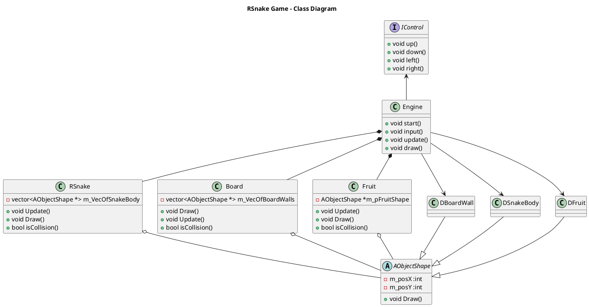

# RSnake

Simple game in C++ base on historical "Snake"

```plantuml
@startuml

title RSnake Game - Class Diagram

class Engine {
  +void start()
  +void input()
  +void update()
  +void draw()
}

class RSnake {
  +void Update()
  +void Draw()
  +bool isCollision()
  -vector<AObjectShape *> m_VecOfSnakeBody
}

abstract AObjectShape {
  + void Draw()
  - m_posX :int
  - m_posY :int

}

interface IControl{
  +void up()
  +void down()
  +void left()
  +void right()
}


class Board {
 +void Draw()
 +void Update()
 +bool isCollision()
 -vector<AObjectShape *> m_VecOfBoardWalls
}

class Fruit {
 + void Update()
 + void Draw()
 +bool isCollision()
 -AObjectShape *m_pFruitShape
}


class DBoardWall
class DSnakeBody
class DFruit

DFruit --|> AObjectShape
DBoardWall --|> AObjectShape
DSnakeBody --|> AObjectShape


Engine *-- RSnake
Engine *-- Board
Engine *-- Fruit
Engine -up-> IControl

Engine --> DFruit
Engine --> DBoardWall
Engine --> DSnakeBody

RSnake o-- AObjectShape
Board o-- AObjectShape
Fruit o-- AObjectShape


@enduml
```

