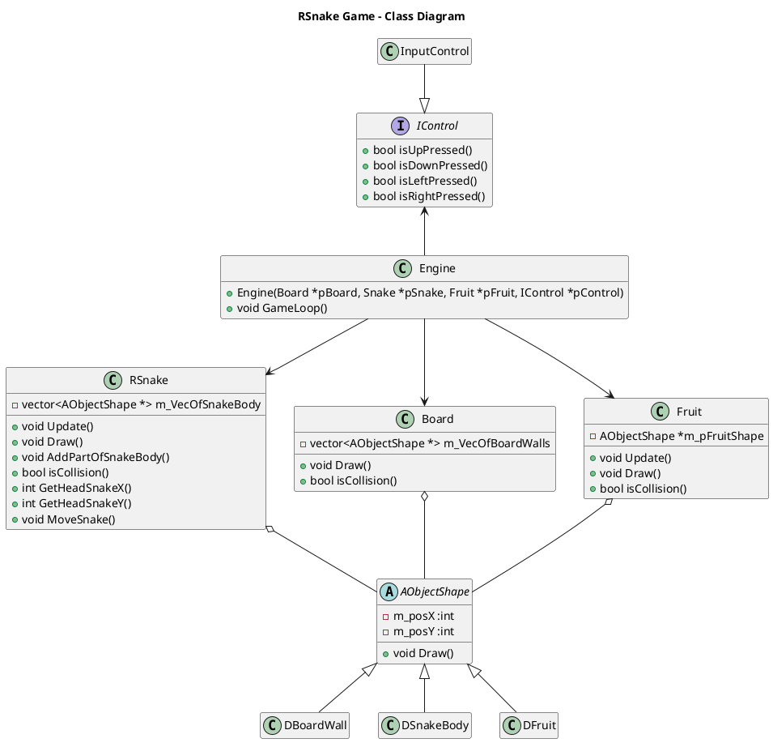

# RSnake

Simple game in C++ base on historical "Snake"

### 1.1 Class Diagram

### 1.2 Building on Windows with CMake and MinGW

Execute the following commands:

> mkdir build
cd build
cmake .. -G "MinGW Makefiles"
mingw32-make

