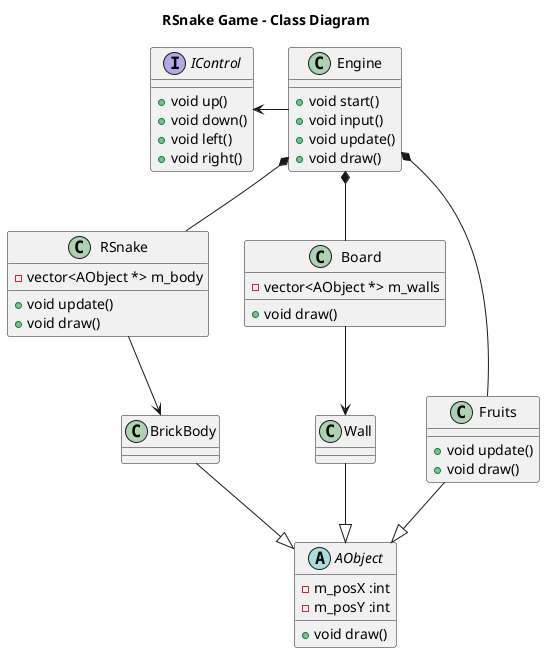

# RSnake

Simple game in C++ base on historical "Snake"

```plantuml
@startuml

title RSnake Game - Class Diagram

class Engine {
  +void start()
  +void input()
  +void update()
  +void draw()
}

class RSnake {
  +void update()
  +void draw()
  -vector<AObject *> m_body
}

abstract AObject {
  + void draw()
  - m_posX :int
  - m_posY :int

}

interface IControl{
  +void up()
  +void down()
  +void left()
  +void right()
}


class Board {
 + void draw()
 -vector<AObject *> m_walls
}

class Fruits {
 + void update()
 + void draw()
}


class Wall
class BrickBody

Fruits --|> AObject
Wall --|> AObject
BrickBody --|> AObject


Engine *-- RSnake
Engine *-- Board
Engine *-- Fruits
Engine -left-> IControl

RSnake --> BrickBody
Board --> Wall


@enduml
```