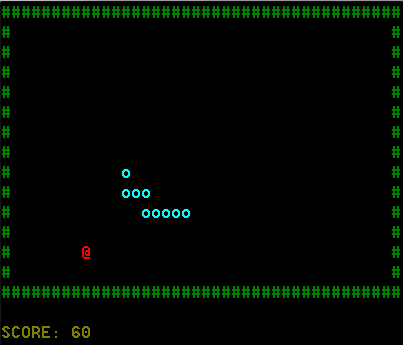

# 🐍 RSnake

Simple console game in C++ based on historical "Snake"



Player Controls:
Keys: <kbd>UP</kbd>, <kbd>DOWN</kbd>, <kbd>LEFT</kbd>, <kbd>RIGHT</kbd>

## 📊 UML Class Diagram


## 🕹️ How to Run
### Building on Windows with CMake and MinGW

Execute the following commands:

```
mkdir build
cd build
cmake .. -G "MinGW Makefiles"
mingw32-make
```


