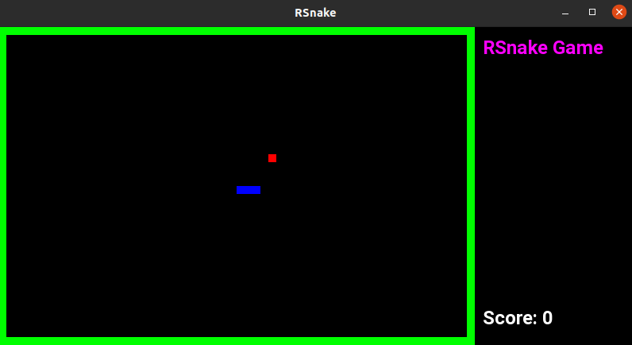

# 🐍 RSnake

Simple console game in C++ based on historical "Snake"

Player Controls:
Keys: <kbd>UP</kbd>, <kbd>DOWN</kbd>, <kbd>LEFT</kbd>, <kbd>RIGHT</kbd>


## Game Evolution

| Version      | Result                              |
|--------------|-------------------------------------|
| 1.0          |      |
| 2.0          |      |
| 3.0          |      |


## VSCode Configuration

Add clang-format and cmake arg to vcpkg handling into `settings.json` file.

```json
{
    "cmake.configureSettings": {
        "CMAKE_BUILD_TYPE": "Debug",
        "CMAKE_CXX_COMPILER": "g++",
        "CMAKE_C_COMPILER": "gcc",
        "CMAKE_EXPORT_COMPILE_COMMANDS": true
    },
    "cmake.buildDirectory": "${workspaceFolder}/build",
    "cmake.configureArgs": [
        "-DCMAKE_TOOLCHAIN_FILE=/home/Programming/vcpkg/scripts/buildsystems/vcpkg.cmake"
    ],
    "clang-format.executable": "clang-format",
    "clang-format.style": "file",
    "clang-format.fallbackStyle": "Microsoft",
    "clang-format.formatOnSave": true,
    "clang-format.formatOnType": true,
    "clang-format.arguments": [
        "-assume-filename=${workspaceFolder}/.clang-format"
    ],
}
```
